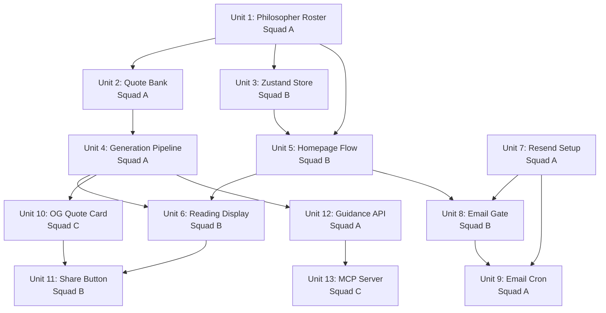

# Sprint 2: Personal Philosophy Engine — Squad Handoff Document

**Date:** April 1, 2026
**Project:** gettodayshoroscope.com
**Plan:** `docs/plans/2026-04-01-002-feat-philosophy-engine-plan.md`
**Requirements:** `docs/brainstorms/2026-04-01-homepage-redesign-email-sharing-requirements.md`

---

## Executive Summary

Transform the horoscope site into a personal philosophy engine. Users pick their sign + 3-5 favorite philosophers from 50+ thinkers. AI generates daily personalized guidance. Email delivery via Resend. Branded social sharing. Public JSON API + MCP server for agent access.

**13 implementation units across 5 phases, assigned to 3 squads.**

---

## Squad Assignments

### Squad A — Content + Backend Engine
**Owner:** Content pipeline, generation logic, API endpoints, email delivery
**Branch prefix:** `feat/squad-a/`

| Unit | Name | Phase | Dependencies |
|------|------|-------|-------------|
| 1 | Philosopher Roster (50+ thinkers) | 1 | None |
| 2 | Expand Verified Quote Bank (500+ quotes) | 1 | Unit 1 |
| 4 | Extend Generation Pipeline for Philosopher Override | 2 | Unit 2 |
| 7 | Resend Integration + Email Template | 3 | None |
| 9 | Daily Email Cron | 3 | Units 7, 8 |
| 12 | Public Guidance API (`/api/guidance`) | 5 | Unit 4 |

**Files owned:**
- `src/constants/philosophers.ts` (create)
- `src/utils/verified-quotes.ts` (modify)
- `src/utils/horoscope-prompts.ts` (modify)
- `src/utils/horoscope-generator.ts` (modify)
- `src/utils/email.ts` (create)
- `src/utils/email-template.ts` (create)
- `src/app/api/guidance/route.ts` (create)
- `src/app/api/cron/daily-horoscope/route.ts` (modify)
- `src/app/api/subscribe/route.ts` (modify)
- `src/app/api/unsubscribe/route.ts` (create)

**DO NOT touch:** `src/app/page.tsx`, `src/components/home/*`, `src/app/api/og/*`, `packages/mcp-server/*`

---

### Squad B — Frontend Homepage Redesign
**Owner:** Homepage UX flow, sign picker, philosopher grid, reading display, soft gate
**Branch prefix:** `feat/squad-b/`

| Unit | Name | Phase | Dependencies |
|------|------|-------|-------------|
| 3 | Extend Zustand Store for Philosopher Selections | 2 | Unit 1 (Squad A) |
| 5 | Homepage Sign Picker + Philosopher Selection Grid | 2 | Units 1, 3 |
| 6 | Reading Display + Brand Positioning | 2 | Units 4 (Squad A), 5 |
| 8 | Soft Email Gate on Homepage | 3 | Units 5, 7 (Squad A) |
| 11 | Share Button | 4 | Units 6, 10 (Squad C) |

**Files owned:**
- `src/app/page.tsx` (modify)
- `src/components/home/HomeFlow.tsx` (create)
- `src/components/home/SignStep.tsx` (create)
- `src/components/home/PhilosopherStep.tsx` (create)
- `src/components/home/PhilosopherCard.tsx` (create)
- `src/components/home/ReadingPreview.tsx` (create)
- `src/components/home/ReadingDisplay.tsx` (create)
- `src/components/home/EmailGate.tsx` (create)
- `src/components/home/ShareButton.tsx` (create)
- `src/components/seo/HeroIntro.tsx` (modify — brand positioning copy)
- `src/hooks/useMode.ts` (modify)

**DO NOT touch:** `src/utils/horoscope-generator.ts`, `src/utils/verified-quotes.ts`, `src/app/api/*`, `packages/mcp-server/*`

---

### Squad C — Sharing + Agent API
**Owner:** OG image generation, MCP server package
**Branch prefix:** `feat/squad-c/`

| Unit | Name | Phase | Dependencies |
|------|------|-------|-------------|
| 10 | Branded OG Quote Card | 4 | Unit 4 (Squad A) |
| 13 | MCP Server Package | 5 | Unit 12 (Squad A) |

**Files owned:**
- `src/app/api/og/[sign]/quote/route.tsx` (create)
- `packages/mcp-server/*` (create entire directory)

**DO NOT touch:** `src/app/page.tsx`, `src/components/*`, `src/utils/horoscope-generator.ts`, `src/app/api/horoscope/*`

---

## Execution Timeline

```
WEEK 1 (Parallel Start)
├── Squad A: Unit 1 (philosopher roster) → Unit 2 (quote bank)
├── Squad B: Unit 3 (Zustand store — needs Unit 1 complete)
└── Squad A: Unit 7 (Resend setup — no dependencies, parallel with Unit 2)

WEEK 1-2 (Parallel Build)
├── Squad A: Unit 4 (generation pipeline — needs Unit 2)
├── Squad B: Unit 5 (homepage flow — needs Units 1, 3)
└── Squad C: Waits for Unit 4 (or starts MCP scaffolding)

WEEK 2 (Integration)
├── Squad B: Unit 6 (reading display — needs Units 4, 5)
├── Squad B: Unit 8 (email gate — needs Units 5, 7)
├── Squad C: Unit 10 (OG card — needs Unit 4)
└── Squad A: Unit 9 (email cron — needs Units 7, 8)

WEEK 2-3 (Polish + Ship)
├── Squad B: Unit 11 (share button — needs Units 6, 10)
├── Squad A: Unit 12 (guidance API — needs Unit 4)
└── Squad C: Unit 13 (MCP server — needs Unit 12)
```



---

## Branching Strategy

### Branch Naming

```
feat/{squad}/{unit-number}-{slug}

Examples:
  feat/squad-a/u1-philosopher-roster
  feat/squad-a/u2-quote-bank-expansion
  feat/squad-b/u3-zustand-philosophers
  feat/squad-b/u5-homepage-flow
  feat/squad-c/u10-og-quote-card
  feat/squad-c/u13-mcp-server
```

### Rules

1. **NEVER commit directly to `main`.** All changes go through PRs
2. **One branch per unit.** Each implementation unit gets its own branch
3. **Branch from `origin/main`** always: `git fetch origin && git checkout -b feat/{squad}/{unit}-{slug} origin/main`
4. **Merge via squash:** `gh pr merge --squash --auto`
5. **Feature branches live 1-3 days max.** If a unit takes longer, break it into stacked PRs
6. **Cross-squad dependencies:** When Squad B needs Squad A's Unit 4 merged, wait for the PR to merge to main. DO NOT branch from another squad's feature branch

### Merge Order (Critical)

PRs must merge in dependency order. A squad should not open a PR for a unit until its dependencies are merged to main:

```
Unit 1 → Unit 2 → Unit 4 → Units 3, 5, 7 (parallel) → Units 6, 8, 10 → Units 9, 11, 12 → Unit 13
```

---

## Enforcement Hooks

The project inherits the global enforcement hooks from `~/.claude/hooks/enforcement/`. These apply to ALL branches:

### Hard Blocks (exit 2)

| Hook | Blocks |
|------|--------|
| `security-gate-bash.sh` | `rm -rf /`, `git reset --hard`, force push to main, `DROP TABLE`. Blocks `gh pr merge` without `/ce:review`. Blocks all Bash commands after `git push` until `/watch-ci` runs |
| `security-gate-files.sh` | Edits to `.env*`, credentials, keys. Prompts for auth/payment files |
| `branch-discipline.sh` | `git commit`/`git push` on main. Prompts on squad mismatch (e.g., Squad A agent committing on a Squad B branch) |

### Soft Reminders (exit 0)

| Hook | Injects |
|------|---------|
| `phase-detect-context.sh` | Detects CE workflow phase, injects branch + squad context |
| `stop-test-reminder.sh` | Reminds if commits happened but no tests ran |
| `post-git-actions.sh` | After push/PR/merge: sets `/watch-ci` gate + CE Review gate |
| `detect-test-run.sh` | Tracks when tests were run in session |
| `clear-review-gate.sh` | Clears CE Review gate after `/ce:review` completes |

### Squad Mismatch Detection

The `branch-discipline.sh` hook reads the branch prefix to determine the squad. If an agent on Squad A tries to commit to a `feat/squad-b/*` branch, it will prompt for confirmation. This prevents cross-squad file pollution — the #1 recurring process failure from the Sovren project.

---

## Quality Gates

### Per-PR (Before Merge)

1. **CI passes** — Build & Lint must be green (`/watch-ci`)
2. **CE Review** — Run `/ce:review` on the branch before merge. The `security-gate-bash.sh` hook enforces this (blocks `gh pr merge` without review)
3. **Visual check** — For any unit that changes UI (Units 5, 6, 8, 11), screenshot the affected pages before and after. The Sprint 3 visual regression pattern (7 hotfix PRs) must not repeat

### Per-Phase (Before Next Phase Starts)

1. **Phase 1 gate:** All 50+ philosophers have entries in `philosophers.ts`. All have 10+ verified quotes in `verified-quotes.ts`. `VALID_AUTHORS` updated. Tests pass
2. **Phase 2 gate:** Homepage renders the full flow (sign → philosophers → reading). Return visit works. Existing sign pages unchanged. No visual regression
3. **Phase 3 gate:** Email sends successfully via Resend. Soft gate captures email. Unsubscribe works. CAN-SPAM compliant
4. **Phase 4 gate:** OG quote card renders correctly. Share button works on mobile (Web Share API) and desktop (clipboard). Shared links show branded preview
5. **Phase 5 gate:** `/api/guidance` returns valid JSON for all signs. MCP server starts and exposes tool. Rate limiting works

---

## Critical Constraints

| Constraint | Impact | How to Handle |
|-----------|--------|--------------|
| **Vercel 10s timeout** | Can't batch-send emails or batch-generate | Send emails individually via `waitUntil()`. Generate horoscopes one-at-a-time |
| **Two Vercel projects** | API routes only on `api.gettodayshoroscope.com` | Squad C: OG endpoint goes in API project. Squad B: frontend components can reference API URLs but can't host API routes |
| **Tailwind v3** | No v4 syntax, no `@import "tailwindcss"` | All new components use utility classes with `@tailwind` directives. Follow glassmorphic pattern from existing components |
| **Single OpenAI callsite** | All generation through `horoscope-generator.ts` | Squad A owns this file. Extension only (add philosopher override), never rewrite |
| **Redis manual serialization** | `automaticDeserialization: false` | All Redis writes go through `safelyStoreInRedis`. Never write directly to Redis client |
| **No edge runtime for OpenAI** | Edge functions can't import OpenAI SDK | OG image routes (Squad C) are edge runtime. Guidance API (Squad A) is standard Node runtime |
| **Redis double-prefix** | `horoscope-prod:horoscope-prod:` pattern is self-consistent | Do NOT try to fix this. Use `safelyStoreInRedis`/`safelyRetrieveForUI` which handle it |

---

## Prerequisites

### Human (one-time, before Phase 3)
- [ ] **Install the Resend + Vercel integration** from Vercel dashboard → Integrations → Resend. This auto-creates `RESEND_API_KEY` in your Vercel environment — no manual key copy-paste needed. (URL: vercel.com/integrations/resend)
- [ ] **npm account** ready for MCP server publishing — only needed in Phase 5 (skip if you already have one)

Note: Phases 1 and 2 (content + homepage redesign) have zero external dependencies. Resend setup is only needed before Phase 3 (email delivery). You can start the sprint immediately.

### Agent-Automated (Squad A, Unit 0 — pre-flight before Phase 3)
When Phase 3 begins, Squad A's first action is environment setup:
- [ ] Verify `RESEND_API_KEY` exists in Vercel env: `vercel env ls | grep RESEND`
- [ ] Generate `UNSUBSCRIBE_SECRET` via `openssl rand -hex 32`
- [ ] Store `UNSUBSCRIBE_SECRET` in Vercel via `vercel env add UNSUBSCRIBE_SECRET production`
- [ ] Add Resend domain verification: use Resend API (`POST /domains`) to register `gettodayshoroscope.com` and retrieve required DNS records
- [ ] Output exact DNS records for the user to add at their registrar (or use registrar API if available)
- [ ] Verify DNS propagation via `dig TXT gettodayshoroscope.com` and Resend verification endpoint
- [ ] Pull updated env vars: `vercel env pull .env.local`

---

## File Ownership Matrix

| File/Directory | Squad A | Squad B | Squad C |
|---------------|---------|---------|---------|
| `src/constants/philosophers.ts` | CREATE | read | read |
| `src/utils/verified-quotes.ts` | MODIFY | — | — |
| `src/utils/horoscope-prompts.ts` | MODIFY | — | — |
| `src/utils/horoscope-generator.ts` | MODIFY | — | — |
| `src/utils/email.ts` | CREATE | — | — |
| `src/utils/email-template.ts` | CREATE | — | — |
| `src/app/api/guidance/route.ts` | CREATE | — | — |
| `src/app/api/cron/daily-horoscope/route.ts` | MODIFY | — | — |
| `src/app/api/subscribe/route.ts` | MODIFY | — | — |
| `src/app/api/unsubscribe/route.ts` | CREATE | — | — |
| `src/hooks/useMode.ts` | — | MODIFY | — |
| `src/app/page.tsx` | — | MODIFY | — |
| `src/components/home/*` | — | CREATE | — |
| `src/components/seo/HeroIntro.tsx` | — | MODIFY | — |
| `src/app/api/og/[sign]/quote/route.tsx` | — | — | CREATE |
| `packages/mcp-server/*` | — | — | CREATE |

**Zero file overlap between squads.** This is by design — domain-grouped parallel agents with non-overlapping file ownership = 0 merge conflicts.

---

## Context Files for All Squads

Every squad agent must read these files before starting:

1. **`docs/PROJECT_CONTEXT.md`** — Architecture, stack, pitfalls, constraints
2. **`docs/plans/2026-04-01-002-feat-philosophy-engine-plan.md`** — Full implementation plan
3. **`docs/brainstorms/2026-04-01-homepage-redesign-email-sharing-requirements.md`** — All 45 requirements with rationale
4. **`src/constants/zodiac.ts`** — Shared zodiac constants (single source of truth)

### Squad-specific reading:

**Squad A (Content + Backend):**
- `src/utils/horoscope-generator.ts` — understand the generation pipeline before extending
- `src/utils/horoscope-prompts.ts` — understand philosopher rotation before adding override
- `src/utils/verified-quotes.ts` — understand quote structure before expanding
- `src/app/api/cron/daily-horoscope/route.ts` — understand cron pattern before adding email sends
- `src/utils/redis-helpers.ts` — understand safe Redis read/write pattern

**Squad B (Frontend):**
- `src/hooks/useMode.ts` — understand Zustand store before extending
- `src/components/zodiac/ZodiacCard.tsx` — glassmorphic card pattern to follow
- `src/components/zodiac/SignPicker.tsx` — sign selection pattern (adapt, don't reuse)
- `src/components/seo/FAQAccordion.tsx` — client component with state pattern
- `src/app/horoscope/[sign]/SignPageClient.tsx` — data fetching + Web Share API pattern

**Squad C (Sharing + Agent):**
- `src/app/api/og/[sign]/route.tsx` — existing OG image pattern to extend
- External: `@modelcontextprotocol/server` TypeScript SDK docs
- External: Resend developer docs (for understanding email template integration points)

---

## Definition of Done

The sprint is complete when:

1. A first-time visitor can: pick their sign → pick 3-5 philosophers → enter email → see their personalized reading → share a branded quote card
2. A return visitor sees their personalized reading immediately (no gate)
3. All email subscribers receive a daily personalized email via Resend with unsubscribe link
4. `GET /api/guidance?sign=aries&philosophers=seneca,feynman` returns valid JSON
5. MCP server is published to npm and installable in Claude Code
6. All existing sign pages, monthly pages, and sitemap continue to work (no regression)
7. `/ce:review` passes on all merged PRs
8. `/ce:compound` has been run to document learnings

---

## How to Start

```bash
# Squad A: Start with Unit 1
cd ~/Desktop/horoscope-ai-app
git fetch origin && git checkout -b feat/squad-a/u1-philosopher-roster origin/main

# Squad B: Wait for Unit 1, then start Unit 3
git fetch origin && git checkout -b feat/squad-b/u3-zustand-philosophers origin/main

# Squad C: Wait for Unit 4, or scaffold MCP server package structure
git fetch origin && git checkout -b feat/squad-c/u13-mcp-server origin/main
```

Squads A and B start in parallel. Squad C starts in Week 2 after the generation pipeline (Unit 4) is merged.
